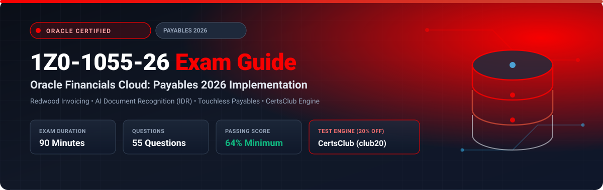

  

# Oracle Financials Cloud: Payables 2026 Implementation Professional (1Z0-1055-26) Exam Study Guide & Practice Test Resource Portal

[-f80000?style=for-the-badge&logo=oracle&logoColor=white)](https://education.oracle.com/)

[-28a745?style=for-the-badge&logo=shield)](https://www.certsclub.com/oracle/)

---

## 1. Exam Overview & Candidate Profile

The **Oracle Financials Cloud: Payables 2026 Implementation Professional (1Z0-1055-26)** exam validates that an implementation consultant can deploy and configure modern Payables solutions in Oracle ERP Cloud. The 2026 blueprint emphasizes intelligent document processing via Intelligent Document Recognition (IDR), touchless invoice automation, Redwood supplier portal experiences, B2B payment automation, and automated period-close accounting validations.

Passing 1Z0-1055-26 grants the **Oracle Financials Cloud: Payables 2026 Certified Implementation Professional** credential.

### Target Candidate Profile & Career Roles
* **Lead Payables Functional Consultants**
* **Procure-to-Pay (P2P) Systems Architects**
* **ERP Financial Automation Leads**

---

## 2. Key Exam Specifications

| Parameter | Official Specification |
| :--- | :--- |
| **Exam Code** | 1Z0-1055-26 |
| **Exam Title** | Oracle Financials Cloud: Payables 2026 Implementation Professional |
| **Associated Credential** | Oracle Financials Cloud: Payables 2026 Certified Implementation Professional |
| **Duration** | 90 Minutes |
| **Number of Questions** | 55 Questions |
| **Passing Score** | 64% |
| **Question Format** | Multiple Choice (Single and Multiple Select) |
| **Delivery Vendor** | Pearson VUE / Oracle University Online Remote Proctoring |
| **Recommended Practice Test Engine** | **[1Z0-1055-26 Practice Test - CertsClub](https://www.certsclub.com/oracle/)** (Coupon: `club20` for 20% off) |

---

## 3. Official Blueprint & Exam Domain Breakdown

| Domain Code | Domain Title | Weighting | Key Competencies Covered |
| :--- | :--- | :---: | :--- |
| **1.0** | **Payables Setup & Redwood User Experience** | **20%** | Common options, Invoice and payment options, Redwood invoice entry flows, Setup Manager. |
| **2.0** | **Supplier Governance & Portal Management** | **20%** | Supplier qualification, Bank verification, Self-service supplier portal in Redwood. |
| **3.0** | **Intelligent Document Recognition (IDR) & Invoicing** | **25%** | IDR machine learning extraction, Adaptive invoice matching, Auto-validation, Hold resolution. |
| **4.0** | **Payment Automation & Cash Management Linkage** | **20%** | Automated payment process requests (PPR), ISO 20022 formats, Bank integration, Positive Pay. |
| **5.0** | **Accounting & Period Close Analytics** | **15%** | Subledger Accounting (SLA) rules, Payables to GL reconciliation, Unaccounted transaction sweeps. |

---

## 4. Scenario-Based Demo Question & Explanation

### Question 1: Intelligent Document Recognition (IDR)
**Scenario:** A client receives vendor invoices via email in PDF format. The accounts payable department wants these emails automatically imported, scanned for header and line item data via machine learning, and converted into draft Payables invoices without manual data entry.

Which Oracle Cloud feature delivers this capability?

A) Data Pump Import  
B) **Intelligent Document Recognition (IDR)** with email ingestion  
C) ADFdi Spreadsheet Upload  
D) Manual Voucher Entry  

**Correct Answer:** **B**

**Detailed Explanation:**
* **Intelligent Document Recognition (IDR)** in Oracle ERP Cloud automatically extracts invoice details from emailed attachments using pre-trained and adaptive machine learning models, creating Payables invoices in touchless or near-touchless workflows.

---

## 5. Recommended Preparation Strategy & Practice Testing Engine

1. **Practice Redwood Payables Workflows:** Test IDR invoice ingestion and payment process runs in a 2026 pod.
2. **Practice with Full-Length Mock Exams:** Use **[CertsClub Oracle 1Z0-1055-26 Practice Tests](https://www.certsclub.com/oracle/)**.
   * Up-to-date with 2026 exam revisions and scenario questions.
   * Enter discount coupon code **`club20`** at checkout on [CertsClub](https://www.certsclub.com/oracle/) for an immediate 20% discount.

---

## 6. Official Documentation & References

* [Oracle Financials Cloud Payables 2026 Documentation](https://docs.oracle.com/en/cloud/saas/financials/payables/)
* [Oracle University 1Z0-1055-26 Exam Details](https://education.oracle.com/)
* [CertsClub 1Z0-1055-26 Practice Engine](https://www.certsclub.com/oracle/)
